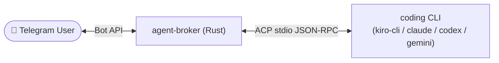
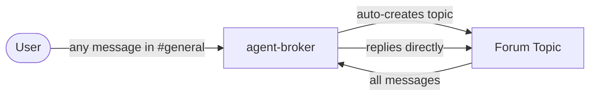
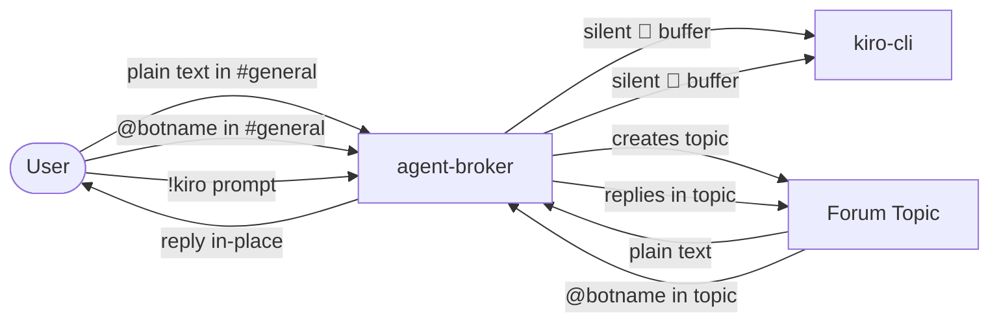
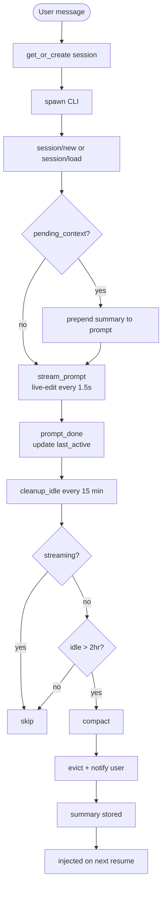
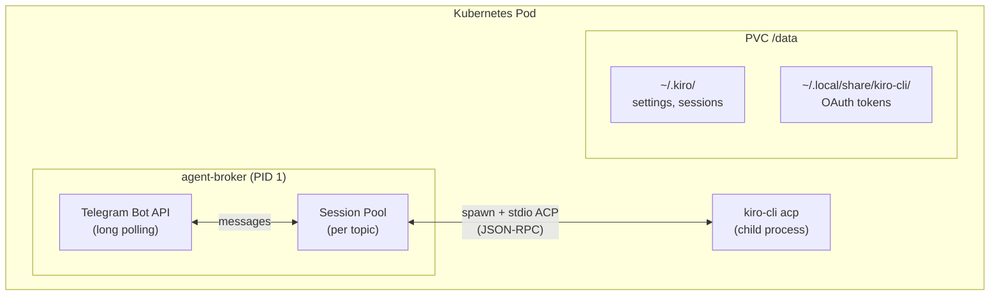

# agent-broker

A Rust bridge service between Telegram and any ACP-compatible coding CLI (Kiro CLI, Claude Code, Codex, Gemini, etc.) using the [Agent Client Protocol](https://github.com/anthropics/agent-protocol) over stdio JSON-RPC.



## Features

- **Pluggable agent backend** — swap between Kiro CLI, Claude Code, Codex, Gemini via config
- **Forum topic threading** — one Telegram forum topic per conversation
- **Edit-streaming** — live-updates the message every 1.5s as tokens arrive
- **Emoji status reactions** — 👀→🤔→🔥/👨‍💻/⚡→👍/😱
- **Session pool** — one CLI process per topic, auto-managed lifecycle
- **Idle eviction** — sessions evicted after 2hr idle, user notified in their topic
- **Memory compaction** — conversation summarized before eviction, injected on resume
- **Bot commands** — `!stop`, `!restart`, `!status`
- **ACP protocol** — JSON-RPC over stdio with tool call, thinking, and permission auto-reply support
- **Kubernetes-ready** — Dockerfile + k8s manifests with PVC for auth persistence

## Chat Modes

### Personal (default)
Best for single-user or private bot usage.



### Team
Best for community / multi-user group chats.



Switch in `config.toml`:
```toml
[telegram]
mode = "team"                  # or "personal"
topic_creator_id = 123456789   # team only: restrict !kiro to this user ID
```

## Session Lifecycle



## Quick Start

### 1. Create a Telegram Bot

1. Open [@BotFather](https://t.me/BotFather) and send `/newbot`
2. Follow the prompts — save the bot token
3. Send `/setprivacy` → select your bot → **Disable** (so it can read group messages)

### 2. Create a Forum Supergroup

Telegram forum topics require a **supergroup with Topics enabled**:

1. Create a new Telegram group
2. Group Settings → **Topics** → enable
3. This converts it to a forum supergroup
4. Add your bot to the group and promote it to admin with these permissions:
   - Manage Topics
   - Send Messages
   - Edit Messages (for live streaming)

### 3. Get Your User ID

Send any message to [@userinfobot](https://t.me/userinfobot) — it replies with your Telegram user ID. Add this to `allowed_users` in config.

### 4. Configure

```bash
cp config.toml.example config.toml
```

Edit `config.toml`:
```toml
[telegram]
bot_token = "${TELEGRAM_BOT_TOKEN}"
allowed_users = [123456789]          # your Telegram user ID

[agent]
command = "kiro-cli"
args = ["acp", "--trust-all-tools"]
working_dir = "/tmp"

[pool]
max_sessions = 10
```

### 5. Build & Run

```bash
export TELEGRAM_BOT_TOKEN="your-token"

# Development
cargo run

# Production
cargo build --release
./target/release/agent-broker config.toml
```

### 6. Use

Send messages in the forum group. See [Chat Modes](#chat-modes) for full personal vs team behavior.

Bot commands (send in any topic):
- `!status` — show session state and last active time
- `!stop` — end the current session
- `!restart` — end session and start fresh

## Session TTL

Sessions are evicted after idle time. Constants in `src/telegram.rs`:

```rust
const CLEANUP_INTERVAL_SECS: u64 = 900;   // check every 15 min
const SESSION_TTL_SECS: u64 = 7200;       // evict after 2hr idle
```

When a session is evicted, the bot sends a ⏱ notification in the topic. The next message resumes with compacted memory context.

## Memory Compaction

Kiro CLI ACP does not support `--resume` and does not replay session history on `session/load` — every new session is a cold start. To work around this, agent-broker compacts the conversation to a summary before eviction and injects it into the first prompt of the new session:

```
[Context from previous session]: Alice is a user who loves blue flowers
and yellow trees. She was asking about...

<user's actual message>
```

The agent answers with full context — no cold start.

## Pluggable Agent Backends

| CLI | Config |
|-----|--------|
| Kiro CLI | `command = "kiro-cli"`, `args = ["acp", "--trust-all-tools"]` |
| Codex | `command = "codex-acp"`, `args = []` |
| Claude Code | `command = "claude-agent-acp"`, `args = []` |
| Gemini | `command = "gemini"`, `args = ["--acp"]` |

## Configuration Reference

```toml
[telegram]
bot_token = "${TELEGRAM_BOT_TOKEN}"  # supports env var expansion
allowed_users = [123456789]          # Telegram user ID allowlist

[agent]
command = "kiro-cli"                 # CLI command
args = ["acp", "--trust-all-tools"]  # ACP mode args
working_dir = "/tmp"                 # agent working directory
env = {}                             # extra env vars passed to the agent

[pool]
max_sessions = 10                    # max concurrent sessions
```

## Kubernetes Deployment

### Pod Architecture



### Deploy

```bash
kubectl create secret generic agent-broker-secret \
  --from-literal=telegram-bot-token="your-token"

kubectl apply -f k8s/configmap.yaml
kubectl apply -f k8s/pvc.yaml
kubectl apply -f k8s/deployment.yaml
```

### Authenticate kiro-cli (first time only)

```bash
kubectl exec -it deployment/agent-broker -- kiro-cli login --use-device-flow
kubectl rollout restart deployment agent-broker
```

## Project Structure

```
├── Dockerfile
├── config.toml.example
├── k8s/
│   ├── deployment.yaml
│   ├── configmap.yaml
│   ├── secret.yaml
│   └── pvc.yaml
└── src/
    ├── main.rs          # entrypoint: tokio runtime, shutdown
    ├── config.rs        # TOML config + ${ENV_VAR} expansion
    ├── telegram.rs      # Telegram bot: topics, streaming, commands
    ├── format.rs        # message splitting (4096 char limit)
    └── acp/
        ├── protocol.rs  # JSON-RPC types + ACP event classification
        ├── connection.rs # spawn CLI, stdio JSON-RPC, pending_context
        └── pool.rs      # session pool, idle eviction, memory compaction
```

## Inspired By

- [sample-acp-bridge](https://github.com/aws-samples/sample-acp-bridge) — ACP protocol + process pool architecture
- [OpenClaw](https://github.com/openclaw/openclaw) — emoji status reaction pattern

## License

MIT
